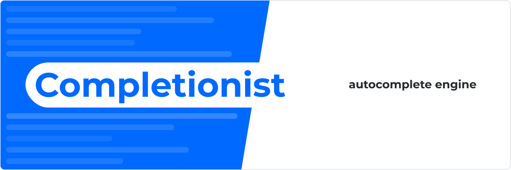

**⚠️ Completionist is not finished, please check out the To-Do for details**

*Completionist - an Open Source C++ Autocomplete Engine*

## Features

### 🤖 Self-building  
Completionist adds terms on-the-fly, updating the phrase data in the background and periodically replacing the old phrase data.

### ⚡ Lightning Fast
Written in C++, the intensive tasks of sorting, searching and ranking results are kept low-level, resulting in completions in only a handful of μ-seconds

### 💾 Memory Efficient
By taking a memory-first approach to suggestions, Completionist removes infrequent suggestions when required to keep within memory limits.

## To-Do
- ~~Phrase map implementation~~ ✔️
- ~~Segment tree implementation~~ ✔️
- ~~Suggestions based on imported data~~ ✔️
- Updating phrase data & Rebuilding segment tree
- Self-building from `std::cin`
- JSON query and response ⏳ *in progress*
- Save and load segment tree & phrase map
- Trim phrases to stay within memory limits
